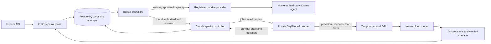

# Queue scheduling and bounded SkyPilot capacity

**Status:** Proposed implementation design

**Date:** 2026-09-21

**Target:** queue policy matures in R0.3-R0.4; bounded cloud capacity enters in R0.7

This design expands [ADR-010](decisions/010-skypilot-boundary.md) without changing its ownership
boundary. Kratos remains the system users submit to and the authority for projects, jobs, budgets,
attempts, artefacts and audit history. SkyPilot is an internal provider used after Kratos decides
that a particular job may consume temporary cloud capacity.

The short answer is: **Kratos controls SkyPilot and asks it to create machines when an authorised
job needs them.** Cloud GPU capacity scales to zero by default. SkyPilot does not get an independent
Kratos-facing queue, choose which Kratos project may spend, or launch capacity merely because work
exists.

This document approves no deployment or cloud spend. It defines the gates an implementation must
satisfy before R0.7 can enable provisioning.

## Goals

- Keep one durable, understandable queue across home and temporary cloud capacity.
- Prefer already available approved capacity when policy allows it.
- Burst to cloud only after explicit project policy, user authority, quota and spend checks pass.
- Use SkyPilot for cloud selection, provisioning, Spot recovery and teardown instead of rebuilding
  those provider-specific mechanisms in Kratos.
- Preserve Kratos attempt identity, provenance, observations and verified artefact delivery on
  every execution path.
- Make cancellation, recovery, charging and resource release visible as separate state changes.
- Detect and remove orphaned billable resources.

## Non-goals

- SkyPilot is not a second user-facing scheduler or source of job truth.
- The first version does not keep an idle GPU pool, promise reservations, or provision across
  multiple clouds.
- SkyPilot estimates are not invoices and do not settle Kratos credits.
- Terraform does not create or destroy ephemeral SkyPilot-owned machines.
- Home workers continue to use the existing Kratos agent and Docker execution path.

## Authority and component boundary



| Concern | Authority |
|---|---|
| Job submission, immutability and cancellation | Kratos |
| Project membership, quotas and priority | Kratos |
| Queue order, blockers and placement policy | Kratos |
| Credit reservation and maximum permitted cloud spend | Kratos |
| Provider, region, zone and machine optimisation inside an approved envelope | SkyPilot |
| Ephemeral machine creation, Spot recovery and teardown | SkyPilot |
| Workload attempt identity and result acceptance | Kratos |
| Provider usage evidence | Cloud billing export, reconciled by Kratos |
| User-visible history, provenance and audit | Kratos |

SkyPilot's managed-job queue may exist as an implementation detail after dispatch. It SHALL NOT be
presented as the Kratos queue or used to make project fairness decisions. A job waiting for the
SkyPilot controller is already in a named Kratos `provisioning` state and retains its Kratos queue
and attempt identity.

## Queue model

PostgreSQL remains the durable source of truth. A submission first becomes `queued` or `blocked`;
it is not sent to any provider during the request that accepts it. A scheduler transaction selects
eligible work and records the placement decision before an external call is made.

### Eligibility

A job is eligible only when all of the following hold:

1. Its earliest-start time has arrived and it is not cancelled.
2. The caller still belongs to the owning project.
3. Its immutable workload and data references remain valid.
4. A compatible resource class exists for its accelerator, memory, trust and locality constraints.
5. Project and user concurrency quotas permit another attempt.
6. Its current quote is valid and the authorised maximum spend can be reserved atomically.
7. The selected provider is allowed by the project's placement policy.

Jobs that fail a gate remain visible with a stable blocker such as `waiting_for_gpu`,
`earliest_start`, `project_quota`, `budget_reservation`, `rate_limit`, `maintenance_window`, or
`cloud_not_authorised`. A single queue-position number SHALL NOT be shown when jobs require
different resource classes; the UI should show the relevant class and blockers instead.

### Ordering and fairness

Within a compatible resource class, the scheduler applies these keys in order:

1. authorised priority band;
2. effective age, including a bounded ageing boost;
3. original eligibility time;
4. stable job identifier as the final tie-breaker.

Project concurrency limits are applied before ordering so one project cannot occupy every slot.
Queue waiting consumes no execution credits. Running work is not preempted merely because a newer
job has higher priority through R0.6; Spot interruption is a provider failure, not queue preemption.

### Placement modes

Each job resolves one immutable placement mode at submission:

| Mode | Behaviour |
|---|---|
| `registered_only` | Wait for an eligible approved Kratos worker; never create cloud capacity. |
| `prefer_registered` | Wait for registered capacity until a displayed threshold, then consider cloud if all cloud gates pass. |
| `cloud_allowed` | Compare eligible registered and cloud choices immediately, within the approved rate and spend ceiling. |

The default is `registered_only`. Enabling either cloud mode requires an explicit maximum provider
spend and maximum hourly rate. A project owner may impose tighter provider, region, accelerator,
concurrency and total-spend limits. Absence of a limit is not permission to spend.

## Dispatch and idempotency

External provisioning cannot be part of a database transaction. The scheduler therefore writes a
`capacity_request` and an outbox event in the same transaction that changes the job to
`provisioning`. A separate cloud capacity controller delivers and reconciles that request.

Every request carries:

- the Kratos project, job and attempt identifiers;
- a deterministic provider request name derived from the attempt identifier;
- the immutable image digest, command and resource envelope;
- permitted provider, region and accelerator alternatives;
- Spot or on-demand policy;
- runtime, recovery and teardown deadlines;
- the reserved provider-spend ceiling and maximum rate; and
- references to short-lived, job-scoped data and result credentials.

The controller records the SkyPilot request, managed-job and cluster identifiers before treating
dispatch as complete. Retrying the outbox event queries those identifiers and converges on the
existing resource; it never creates a second machine for the same provider request. Database row
locks and advisory locks permit multiple controller replicas without duplicate dispatch.

## Initial SkyPilot execution shape

R0.7 starts with **one temporary SkyPilot managed job per Kratos cloud attempt**. This matches
batch training, naturally scales to zero, provides automatic cleanup, and avoids paying for a warm
pool before measured demand justifies one.

The managed job provisions a machine and starts a small Kratos cloud runner. The runner executes
the immutable workload container with the same security and resource envelope used on registered
workers, then sends observations and durable outputs through the existing Kratos protocols. It is
bound to the already selected attempt and cannot claim another queued job.

The runner receives only short-lived credentials for that attempt. The workload itself remains
without general cloud credentials or control-plane authority. Provider credentials stay on the
SkyPilot control plane and are never placed in the workload container.

SkyPilot worker pools and scale-to-zero autoscaling are a later optimisation. They introduce
another capacity queue and shared-machine lifecycle, so they require evidence that per-job cold
start is materially harming throughput or cost. If adopted, Kratos sets the allowed pool bounds;
SkyPilot does not infer an unlimited desired fleet from demand.

## State model and reconciliation

Kratos exposes enough state to distinguish waiting, machine lifecycle and training:

```text
queued / blocked
        |
        v
provisioning -> starting -> running -> uploading -> completed
      |             |          |           |
      +-------------+----------+-----------+--> cancelling -> releasing -> cancelled
                    |
                    +--> recovering --> starting
                    |
                    +--> failed ------> releasing
```

`completed`, `failed` and `cancelled` describe the workload result. `releasing` describes the
remaining billable-resource cleanup. The UI does not say cancellation is complete while a cloud
machine still exists.

The controller continuously reconciles desired Kratos state with SkyPilot state. It handles:

- a lost response after successful submission;
- provisioning failures and exhausted provider capacity;
- a controller restart during provisioning, running or teardown;
- user cancellation at every phase;
- a terminal workload whose cluster is still billable;
- a cluster that disappeared without a terminal result; and
- a provider resource that exists without a live Kratos capacity request.

All SkyPilot-created resources carry immutable Kratos labels. A periodic cloud inventory compares
those labels with live capacity requests. Unknown or terminal resources are quarantined, alerted
and torn down according to policy. Force-removing local SkyPilot state does not count as teardown;
provider inventory must prove billing has stopped.

## Spot interruption and recovery

SkyPilot managed jobs may recover a workload after Spot preemption. Kratos records every provisioned
machine interval as a provider execution segment under the attempt, including region, resource,
start, stop, interruption reason and SkyPilot recovery generation. The run view shows these
segments rather than pretending one uninterrupted machine executed the job.

Spot is permitted only when the workload declares a durable checkpoint contract. Checkpoints must
leave the machine before another segment is authorised. The total recovery count, elapsed runtime
and spend remain bounded by the original authority. A recovery that would cross the maximum rate,
remaining spend or deadline is cancelled rather than silently exceeding it.

R0.7 acceptance must deliberately interrupt a Spot machine, restore from the recorded checkpoint,
produce one authoritative Kratos result, and prove that replay did not duplicate artefacts or
charges.

## Spend and accounting controls

SkyPilot's optimiser and cost report are planning inputs, not accounting truth. Before dispatch,
Kratos reserves the user's authorised worst-case provider spend. A policy controller rejects any
SkyPilot plan outside the permitted cloud, region, accelerator, rate or duration envelope.

The cloud capacity controller emits deduplicated provisional usage segments while resources exist.
Final currency cost comes from provider billing export and is reconciled to Kratos labels. Internal
credits remain a separate ledger with its own published rate and settlement rules. The run view
shows:

- reserved credits and provider-spend ceiling;
- estimated and current provider cost, clearly labelled provisional;
- machine allocation intervals, including setup and recovery;
- time at which cancellation was requested and resources were actually released; and
- final provider cost once billing evidence arrives.

Global and per-project kill switches prevent new provisioning. A separate emergency controller can
cancel active cloud work and request teardown. Neither switch affects already running home jobs.

## Security boundary

- The SkyPilot API server is private and is called only by the Kratos cloud capacity controller.
- The controller uses a dedicated SkyPilot service account token stored in Secret Manager and a
  least-privilege cloud service account restricted to approved projects, regions and resource
  types.
- SkyPilot admin policies enforce the same outer resource envelope server-side; request validation
  in Kratos is not the only control.
- Workload secrets are short-lived and job-scoped. They are not embedded in images, task YAML,
  logs or provider labels.
- Users never receive SkyPilot credentials or direct SSH access through the Kratos run flow.
- Audit events record who authorised cloud use, the resolved policy and quote, every lifecycle
  command, reconciliation outcome and emergency action.

## Deployment and ownership

Terraform owns durable infrastructure: the private SkyPilot API endpoint, service accounts,
network policy, Secret Manager entries, database connectivity, monitoring and billing export.
SkyPilot owns every temporary machine it creates. Kratos owns the intent and tells SkyPilot when to
create or release it. No temporary instance is imported into Terraform state.

The first provider is GCP in one allow-listed project and region set. Multi-cloud placement is
deferred until one-provider provisioning, billing reconciliation and leak detection pass live
acceptance.

## Delivery sequence

1. **Queue policy (R0.3):** projects, quotas, ageing, earliest start, blocker explanations and
   atomic fixed-rate credit reservation.
2. **Recovery authority (R0.4):** checkpoint resume, remaining-budget enforcement and usage
   reconciliation.
3. **Provider contract:** `CapacityProvider` interface, capacity requests, outbox delivery,
   provider execution segments and a fake provider for deterministic failure tests.
4. **SkyPilot evaluation:** private API server in a non-production project, on-demand temporary
   job, cancellation and proven teardown. No automatic user traffic.
5. **Bounded GCP pilot:** explicit per-job cloud opt-in, one accelerator class, one concurrent job,
   low project spend ceiling and scale-to-zero.
6. **Spot acceptance:** checkpointed interruption recovery, billing reconciliation and orphan scan.
7. **Expansion:** only after evidence, widen accelerator classes, regions, concurrency or clouds.

## Acceptance gates

Cloud provisioning remains disabled until all of these have automated and live evidence:

- two scheduler/controller processes cannot dispatch the same attempt twice;
- a queued cancellation cannot create a machine;
- cancellation during provisioning eventually proves that no billable resource remains;
- a controller restart converges without duplicate machines or lost results;
- an unauthorised project, exhausted quota or failed reservation creates no SkyPilot request;
- an out-of-policy SkyPilot plan is rejected before launch;
- a successful run produces the same observations, provenance and verified artefacts as a home run;
- Spot interruption recovers from a durable checkpoint within the original bounds;
- provider usage replay cannot duplicate credits or currency cost;
- leaked-resource scanning detects and removes a deliberately orphaned test machine; and
- the whole path returns to zero GPU resources after success, failure and cancellation.

## Alternatives considered

| Option | Assessment |
|---|---|
| Let SkyPilot own the user-facing queue | Rejected. Project fairness, blockers, budgets and audit would split across two systems. |
| Provision a permanent GPU pool first | Rejected. It creates idle spend before demand and cold-start measurements justify it. |
| Have SkyPilot provision ordinary workers that claim any queued job | Rejected initially. A delayed worker could race registered capacity and claim a different job; binding one temporary runner to one attempt is easier to make idempotent. |
| Integrate directly with the GCE API | Deferred. It removes a component but makes Kratos own instance selection, Spot recovery and cross-region fallback that SkyPilot already provides. Reconsider if the SkyPilot boundary cannot satisfy cost, security or recovery evidence. |
| Let Terraform manage temporary instances | Rejected. Two lifecycle owners would fight, and Terraform reconciliation is not a per-job scheduler. |

## SkyPilot capabilities used by this design

The design relies on documented SkyPilot behaviour, while keeping policy in Kratos:

- [Managed Jobs](https://docs.skypilot.ai/en/stable/examples/managed-jobs.html) launch a temporary
  cluster per job, recover from infrastructure interruption and clean up after completion.
- [Autostop and autodown](https://docs.skypilot.ai/en/stable/reference/auto-stop.html) provide a
  second cleanup boundary for non-managed capacity.
- [API server authentication](https://docs.skypilot.ai/en/stable/reference/auth.html) supports
  service accounts for programmatic callers.
- [Worker pools](https://docs.skypilot.ai/en/stable/examples/pools.html) can autoscale to zero, but
  remain deferred here until a shared warm pool is justified.
